Ecommerce LLFW 🛒
Projeto de ecommerce com tema de artigos esportivos, desenvolvido como parte do projeto de final de semestre.

Descrição do Projeto 📋
Este projeto consiste em um sistema de ecommerce funcional com funcionalidades como cadastro de usuários, gerenciamento de produtos e carrinho de compras. O objetivo foi integrar conhecimentos adquiridos em disciplinas como Java, SQL, JSP, Servlets, e HTML/CSS.

Funcionalidades do Sistema 🚀
1. Página Inicial (Index) 🏠
Página principal, onde é possível:
Fazer compras.
Cadastrar-se como usuário.
Fazer login.
Administradores podem acessar funcionalidades exclusivas.

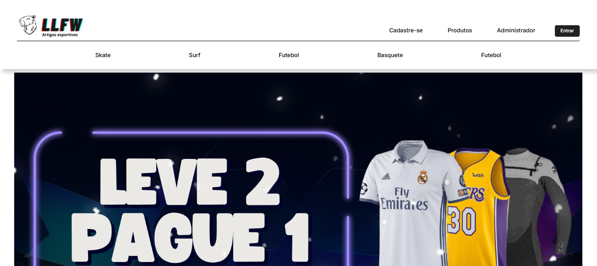
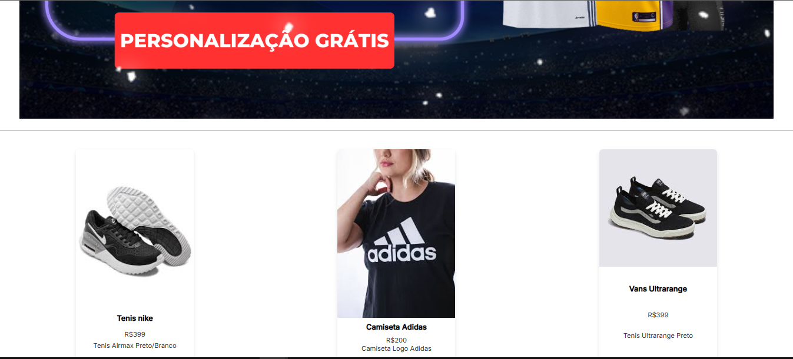
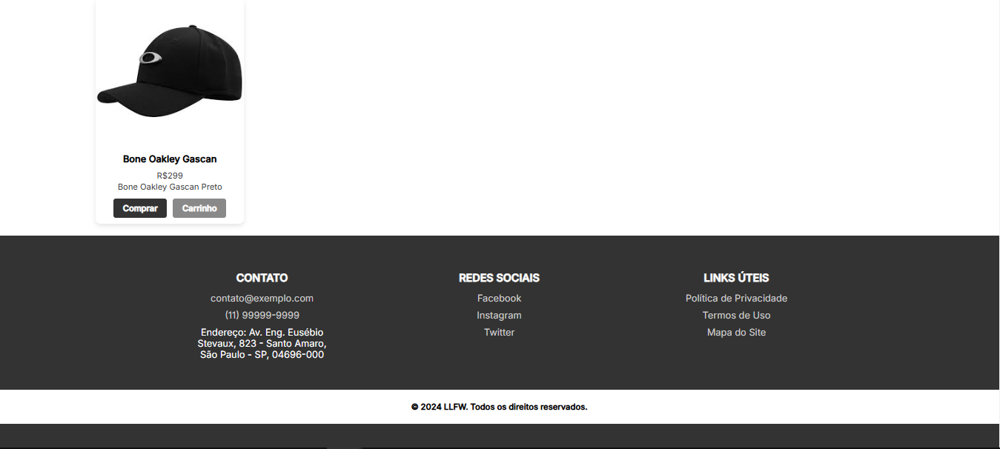

2. Cadastro de Usuário 👤
Formulário para cadastrar novos usuários com os seguintes campos obrigatórios:
Nome, Sobrenome, E-mail, Celular, Estado, Cidade, Rua, Senha e Gênero.
Após o cadastro, o usuário é redirecionado para a página de login.
Exibe mensagem de erro caso o email ou senha estejam incorretos.

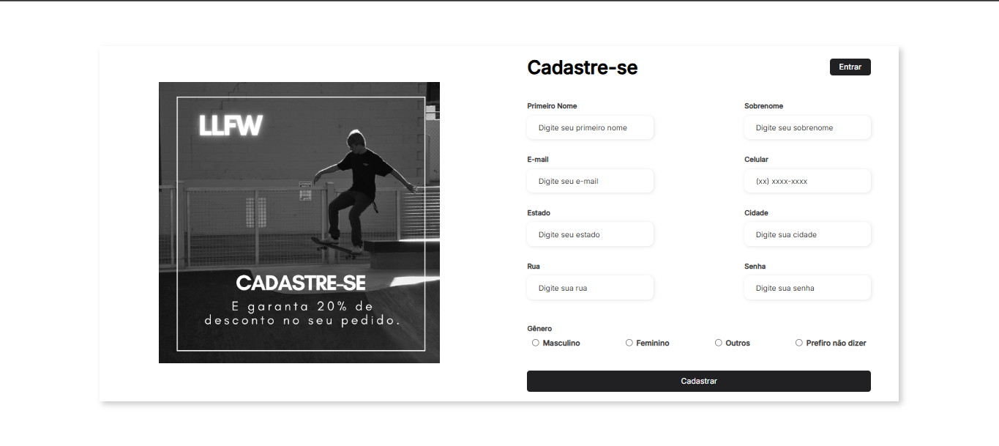
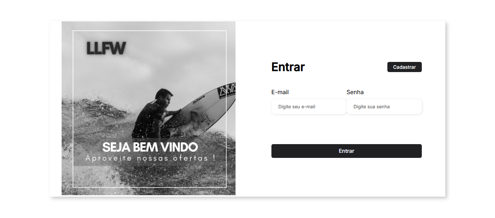

3. Área do Administrador 🛠️
Menu exclusivo para administradores com as seguintes opções:
Adicionar Produtos: Formulário que permite adicionar produtos com Nome, Marca, Modelo, Quantidade, Descrição e Valor.
Alterar Produtos: Visualize e edite os produtos cadastrados, trazendo os dados do banco de dados para o formulário.
Excluir Produtos: Remove o produto tanto do banco quanto da página.
Gerenciar Usuários: Possibilidade de editar ou excluir usuários, além de torná-los administradores.

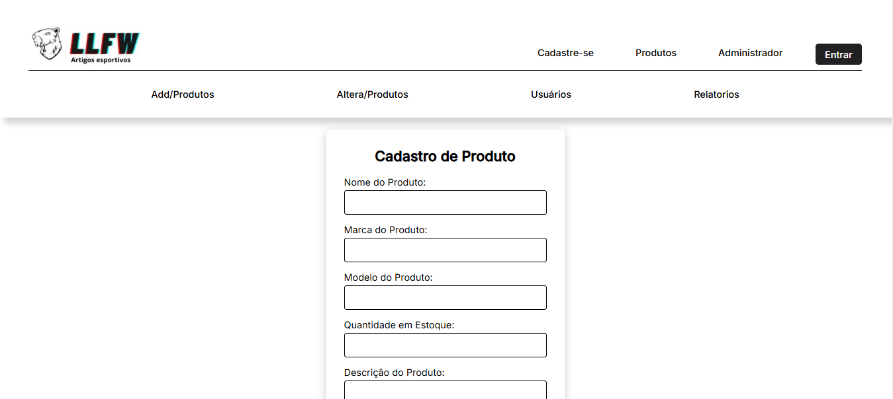
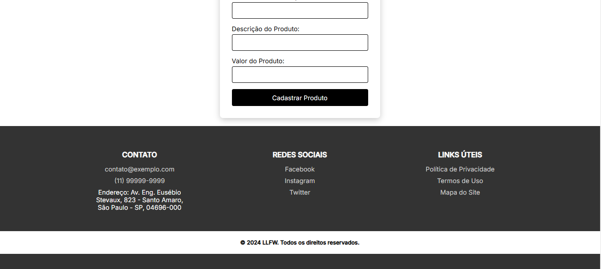

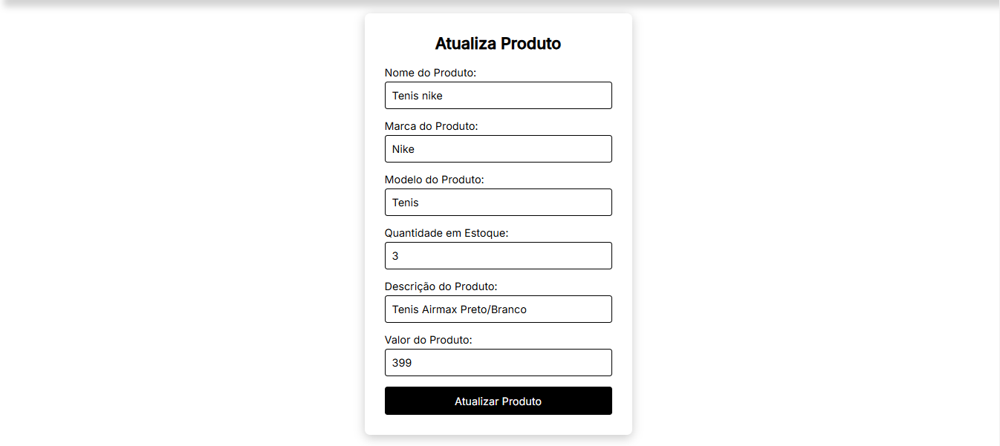

4. Gerenciamento de Usuários 👥
Exibe uma tabela com as informações do usuário:
ID, Nome, Sobrenome, Email, Celular, Gênero, Estado, Cidade e Rua.
Opções disponíveis:
Editar: Redireciona para um formulário pré-preenchido com os dados do banco.
Excluir: Remove o usuário do banco de dados.

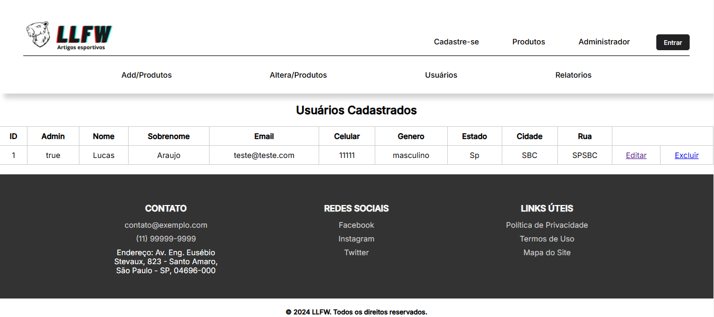

5. Carrinho de Compras 🛒
Funcionalidades:
Exibe os produtos adicionados com a quantidade, preço unitário e subtotal.
Botões disponíveis:
Remover Produto.
Limpar Carrinho.
Continuar Comprando: Redireciona para a página inicial, permitindo adicionar mais itens ao carrinho.
Cálculo automático do valor total dos produtos.

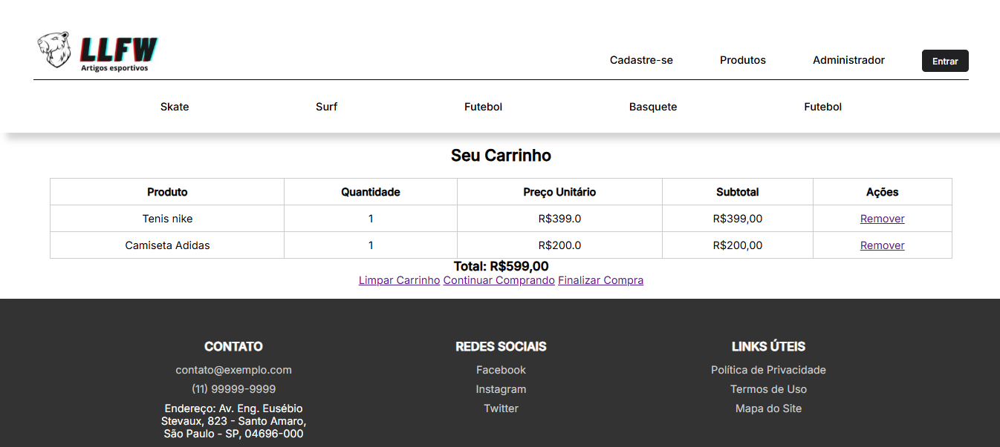

6. Modelo do Banco de Dados 🗄️
Abaixo está o diagrama do banco de dados utilizado no projeto, mostrando as tabelas, colunas e relacionamentos:

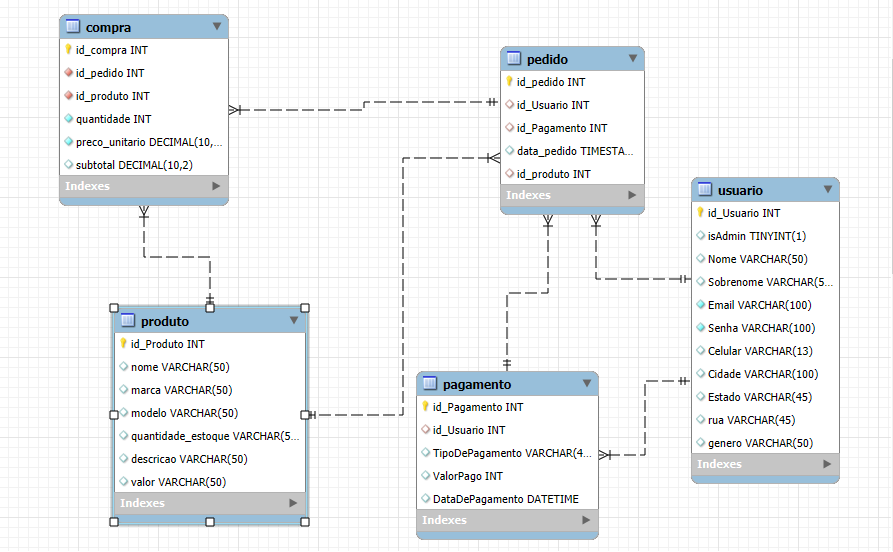

Pontos Pendentes 🔧
Página de finalização de compra ainda não foi implementada.
Não há verificação de permissão para acessar a área de administrador; todos podem acessar.

Como Usar? 📖
Clone o repositório:
git clone https://github.com/seu-usuario/Ecommerce-LLFW.git
Importe o projeto para a IDE (como Eclipse).
Configure o servidor Tomcat e conecte o banco de dados.
Inicie o servidor e acesse localhost:8080/EcommerceLLFW.

Tecnologias Utilizadas 🛠️
Java com Servlets e JSP.
Banco de Dados SQL.
HTML5 e CSS3.

Sobre o Projeto e o Autor ✍️
Desenvolvido por Lucas, estudante de TI focado em desenvolvimento back-end. Este projeto foi criado para demonstrar habilidades adquiridas durante o semestre, integrando várias tecnologias e abordagens.